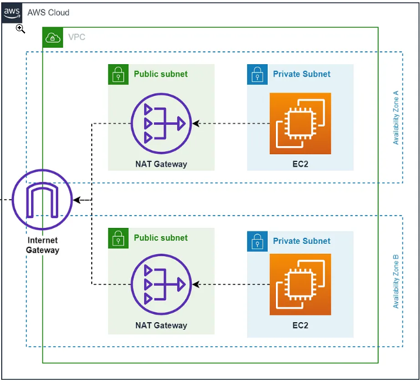

# 🔀 AWS NAT Gateway for Private Subnets


This project demonstrates how to configure an **AWS NAT Gateway** to provide **secure outbound internet access** for instances running in a **private subnet**, while keeping them inaccessible from the public internet.

It builds on a custom VPC architecture consisting of public and private subnets, an Internet Gateway, Route Tables, and Amazon EC2 instances.

---

# 📖 Table of Contents

* [Overview](#-overview)
* [Architecture](#-architecture)
* [Features](#-features)
* [Prerequisites](#-prerequisites)
* [Deployment Steps](#-deployment-steps)
* [Project Structure](#-project-structure)
* [AWS Resources Used](#-aws-resources-used)
* [Cleanup](#-cleanup)
* [Cost Note](#-cost-note)
* [Future Improvements](#-future-improvements)
* [Author](#-author)

---

# 📌 Overview

Private subnet resources should never be directly exposed to the internet, but they often need outbound internet connectivity for tasks such as:

* Installing software packages
* Downloading operating system updates
* Accessing external APIs
* Pulling application dependencies

AWS **NAT Gateway** solves this problem by allowing instances in a private subnet to initiate outbound internet connections while blocking inbound traffic initiated from the internet.

---

# 🏗️ Architecture

<p align="center">
  
</p>

---

# ✨ Features

* 🌐 Custom AWS VPC
* 📡 Public & Private Subnets
* 🌍 Internet Gateway
* 🔀 NAT Gateway
* 🔑 Elastic IP
* 🛣️ Public & Private Route Tables
* 💻 Public EC2 Instance (Bastion Host)
* 🔒 Private EC2 Instance
* ☁️ Secure outbound internet access

---

# 📋 Prerequisites

Before starting, ensure you already have:

* AWS Account
* Custom VPC
* Public Subnet
* Private Subnet
* Internet Gateway
* Public & Private Route Tables
* Public EC2 Instance
* EC2 Key Pair

---

# 🚀 Deployment Steps

## Step 1 — Allocate an Elastic IP

Navigate to:

**VPC → Elastic IPs → Allocate Elastic IP**

Create a new Elastic IP.

Example name:

```text
demo-natgw-eip
```

---

## Step 2 — Create the NAT Gateway

Navigate to:

**VPC → NAT Gateways → Create NAT Gateway**

Use the following configuration.

| Setting           | Value                 |
| ----------------- | --------------------- |
| Name              | demo-NATGW            |
| Subnet            | demo-public-subnet-1a |
| Connectivity Type | Public                |
| Elastic IP        | demo-natgw-eip        |

Wait until the NAT Gateway status becomes **Available**.

> **Important:** A NAT Gateway must always be deployed inside a **public subnet**.

---

## Step 3 — Update the Private Route Table

Edit **demo-private-RT** and add:

| Destination | Target     |
| ----------- | ---------- |
| 10.0.0.0/16 | local      |
| 0.0.0.0/0   | demo-NATGW |

This allows instances in the private subnet to reach the internet through the NAT Gateway.

---

## Step 4 — Launch an EC2 Instance in the Private Subnet

Launch another EC2 instance with the following configuration.

| Setting               | Value                  |
| --------------------- | ---------------------- |
| AMI                   | Amazon Linux 2         |
| Instance Type         | t3.micro               |
| VPC                   | demo-vpc               |
| Subnet                | demo-private-subnet-1a |
| Auto Assign Public IP | Disabled               |

Configure the Security Group to allow SSH only from the public EC2 instance (or Bastion Host).

---

## Step 5 — Verify Connectivity

### Connect to the Public EC2

```bash
ssh -i demo_ec2.pem ec2-user@<public-instance-ip>
```

---

### Connect to the Private EC2

```bash
chmod 400 demo_ec2.pem

ssh -i demo_ec2.pem ec2-user@<private-instance-private-ip>
```

---

### Test Internet Connectivity

```bash
sudo yum update -y

curl -I https://www.google.com
```

Expected Output

```text
HTTP/2 200
```

This confirms that:

* ✅ NAT Gateway is functioning correctly.
* ✅ Private EC2 has outbound internet access.
* ✅ No Public IP is required.

---

# 📂 Project Structure

```text
AWS-NAT-Gateway/
│
├── README.md
└── images/
    └── vpc-nat-architecture.png
```

---

# 📚 AWS Resources Used

* Amazon VPC
* Public Subnet
* Private Subnet
* Internet Gateway
* NAT Gateway
* Elastic IP
* Route Tables
* Security Groups
* Amazon EC2

---

# 💰 Cost Note

> **Note:** AWS NAT Gateway is **not included in the Free Tier**.

Charges apply for:

* Hourly usage
* Data processed through the NAT Gateway

For learning purposes, delete the NAT Gateway and release the Elastic IP after completing the project to avoid unnecessary charges.

---

# 🧹 Cleanup

After testing:

1. Terminate both EC2 instances.
2. Delete the NAT Gateway.
3. Release the Elastic IP.
4. Remove the NAT Gateway route from the private Route Table.
5. (Optional) Delete the Route Tables, Internet Gateway, Subnets, and VPC.

---

# 🚀 Future Improvements

You can extend this architecture by adding:

* Application Load Balancer (ALB)
* Auto Scaling Group
* Amazon RDS in a Private Subnet
* Bastion Host with SSH Agent Forwarding
* AWS Systems Manager Session Manager
* CloudFormation or Terraform
* GitHub Actions CI/CD

---

# 👨‍💻 Author

**Ved Dandotia**

* 🌐 Portfolio: https://techxved.me
* 💼 LinkedIn: https://linkedin.com/in/ved-dandotia-b069a5329
* 🐙 GitHub: https://github.com/TechxVed

---

## ⭐ Support

If you found this project helpful, consider giving it a **⭐ Star** on GitHub. It helps others discover the project and motivates me to create more AWS, Cloud, and DevOps content.

Happy Cloud Learning! ☁️🚀
